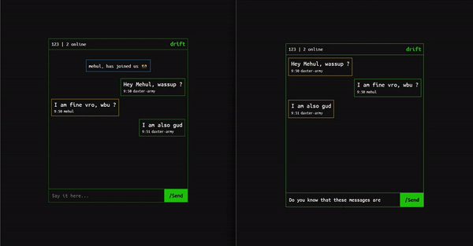
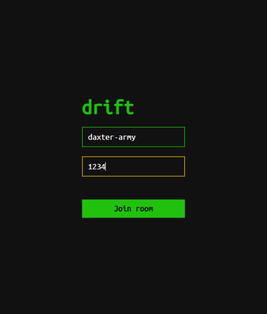
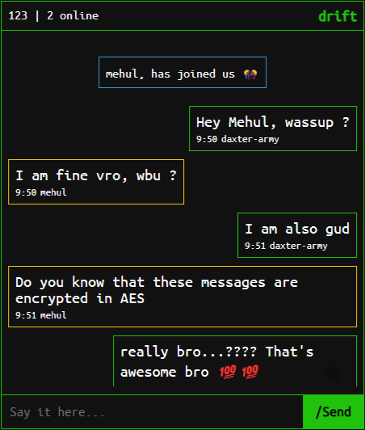

<p align="center">
  <a href="https://github.com/daxter-army/drift/">
    
  </a>
  <p align="center">
    AES Encrypted Messenger
    <br />
    <a target="_blank" href="https://daxter-drift.herokuapp.com">Visit</a>
  </p>
</p>

## 🕹️ Demo

<p align="center">

</p>

## ✨ Introduction

A chat application built with React, Nodejs powered by Socket.io, with AES encryption for secure communication.

## 💫 Features

This app comes with a load a features and an amazing UI, which I call, is HackerUI 😄:

- Dedicated rooms for secure and closed communications.
- Other users are notified whenever any user enters/leaves the room.
- All messages are encrypted with **AES Encyption**.
- If you are ⌨️ cli/terminal entusiast, then you will love it's hackerUI 💯.
- If current username is being used, User is redirected back to the login screen.

<br/>
<p align="center">


</p>

## 🔧 Development

### Requirements

- Node >= 14.x, should be installed on your system

### Getting Started

- Clone the repo, and then after getting into the project directory, hit

```js
// This will start the backend server

// windows
npm install | npm run dev

// linux
npm install && npm run dev
```

- Then open another terminal in the ./client subdirectory and hit,

```js
// This will start the frontend server

// windows
npm install | npm start

// linux
npm install && npm start
```

- And your project should be live at http://localhost:3000
